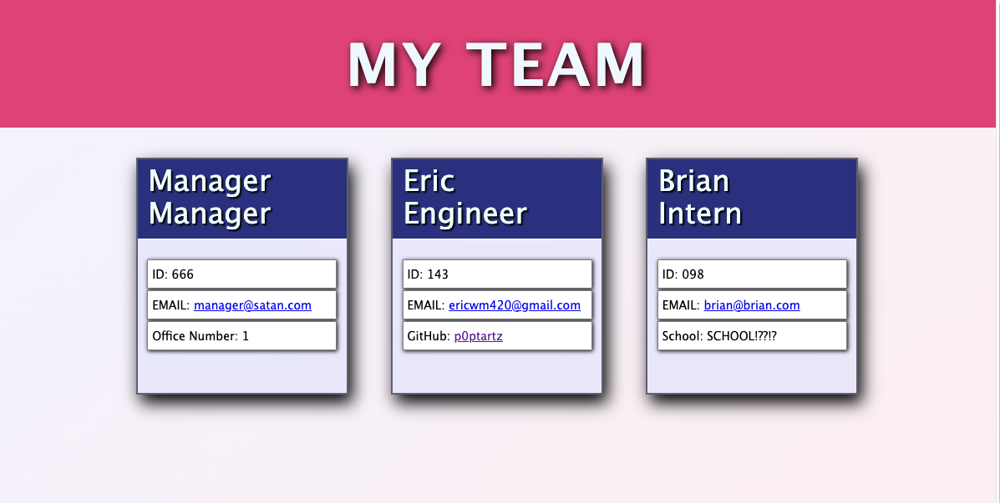
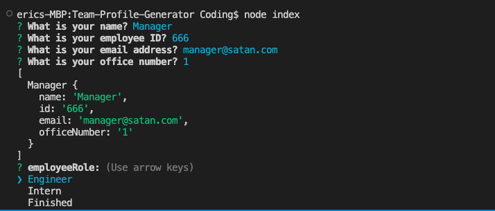
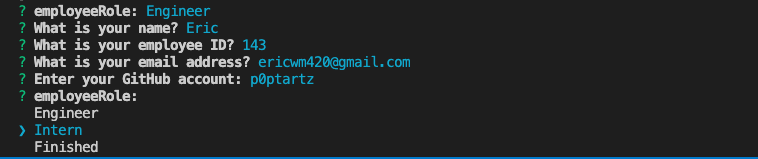
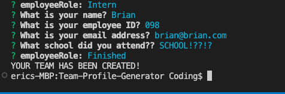

# Team Profile Generator

## Description:

A node.js command line application that lets the user build a software engineering team.  The user will input the correct information about his/hers/their team members which can then be accessed by the generated HTML file.
#
## Installation:
Clone the repo then run the command ```npm install``` 
#
## Usage:
In the terminal, run the command ```node index.js``` \
***MUST HAVE NODE INSTALLED***
#
## Screenshots:
<details>
<summary>HTML view</summary>


</details>

<details>
<summary>Manager cmd</summary>


</details>

<details>
<summary>Engineer cmd</summary>


</details>

<details>
<summary>Intern cmd</summary>


</details>

#

## Video Demo:
[THIS IS A LIVE DEMO](https://drive.google.com/file/d/1tDf0HtHsfYRw-vfR1l3c2C0Fc-K_v7_q/view)
#